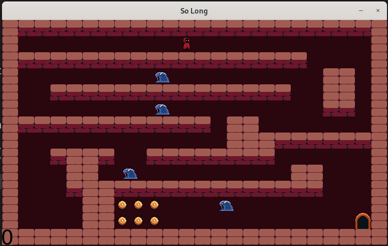

# so_long (42)

A small 2D game built with MiniLibX as part of the 42 cursus.

The goal is simple: collect all collectibles, then reach the exit using the fewest moves possible.

## Features

- Real-time tile-based rendering with MiniLibX
- Strict map validation before launch
- Move counter display
- Win screen when the objective is completed
- Bonus mode with enemy + player animation

## Project Structure

```text
so_long/
├── Makefile
├── main.c                # Mandatory entry point
├── bonus/main_bonus.c    # Bonus entry point
├── maps/                 # Example .ber maps
├── textures/             # Sprites / UI assets
└── mlx/                  # MiniLibX headers
```

## Requirements

- Linux
- `cc` (or `gcc`/`clang`) with support for `-Wall -Wextra -Werror`
- X11 development libraries (linked with `-lX11 -lXext`)
- MiniLibX available for linking as `-lmlx`

## Build

From the `so_long/` directory:

```bash
make
```

Build bonus version:

```bash
make bonus
```

Cleanup:

```bash
make clean
make fclean
make re
```

## Run

Mandatory:

```bash
./so_long maps/map.ber
```

Bonus:

```bash
./so_long_bonus maps/map_bonus.ber
```

## Controls

- `W` → move up
- `A` → move left
- `S` → move down
- `D` → move right
- `ESC` → quit game

## Map Format (`.ber`)

### Mandatory tiles

- `1` wall
- `0` empty floor
- `P` player start (exactly 1)
- `E` exit (exactly 1)
- `C` collectible (at least 1)

### Bonus tile

- `A` enemy

### Validation rules

- File extension must be `.ber`
- Map must be rectangular
- Map must be fully surrounded by walls (`1`)
- Exactly one player and one exit
- At least one collectible
- A valid path must exist from player to:
	- the exit
	- every collectible

## Notes

- This repository includes both mandatory and bonus implementations.
- If the game exits immediately, verify map validity and that all texture files are present.

## Screenshot


